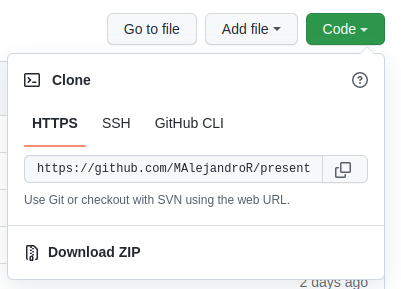

{}
:white_check_mark:
**Objetivo**:
* Crear un repositorio en github
* Crear un proyecto en local, crear un repositorio local y enlazarlo con el repositorio de github
* Realizar cambios en local, subirlo a github, clonar proyectos y actulizarlos

**Páginas referenciadas o de consulta**
* https://https://www.atlassian.com/es/git
{}


## Crear un usuario en git
Para ello accedemos a la página oficial de git https://github.com y buscamos la opción **Sig up**


Una vez presionado el botón, aportamos los datos que nos solicita y nos registramos

## Crear un nuevo repositorio

Entrando con nuestro usuario y password, ya podemos  crear un nuevo repositorio  (la idea es  crear un directorio con un determinado nombre,  para guardar un determinado proyecto en la nube).

Buscamos la opción de  nuevo repositorio  y lo presionamos


Esto,  nos mostrará un menú para  insertar  un nuevo repositorio


Insertamos un nombre y presionamos al final de la página el botón *****Create Repository*****


Una vez creado, vemos una serie de  instrucciones  que debemos de escribir en nuestro equipo local, creando un repositorio en local y  ligándolo a este repositorio


### Crear un proyecto en local y crear un repositorio
Ahora, en  el equipo local  ejecutamos las instrucciones  que nos ha indicado el servidor de github para crear el repositorio en local y vincularlo al repositorio en github.

Previo a configurar el proyecto, y solo la primera vez ya que se hará de forma **global**, vamos a configurar nuestros datos de git en local con los siguientes comandos
```bash
git config --global user.name NombreUsuarioGit
git config --global user.mail emailUsuarioGiyt

```

Una vez configurado el sitio, suponemos que tenemos un proyecto en local bajo un directorio donde nos ubicaremos

Ahí escribimos:
1. **Para crear el directorio en local**
```bash
git init
```
>>Con este comando se  crearé un directorio en local llamado .github que inicializará el repositorio en local
2. **Agregar ficheros al repositorio**
```bash
git add *
```
> Este comando agregará todos los ficheros del directorio al repositorio en local

> Se excluirán aquellos ficheros que estén especificados en un fichero especial llamado .gitignore (el punto es porque es un fichero oculto)
3. **Establecer un comentario de checkpoint**
```bash
git commit -m "Primera actualización del proyecto" 
```
> Creamos un mensaje que se asociará al commit actual cuando subamos los ficheros al proyecto

4. **Establecemos la rama principal de trabajo**
```bash
git branch -m main
```
> En este caso establecemos la rama de trabajo **main**.        

>Un proyecto puede tener varias ramas, las cuales llevan una vida independiente en el desarrollo del proyecto hasta que se unan o establezca un  **merge** al proyecto principal
5. **Ligamos el proyecto local al remoto**
```bash
git remote add origin main   https://github/Usuario/Proyecto.git *
```
> Ligamos el proyecto que tenemos en local al repositorio de github, unido, en este caso, a la rama main. En local la rama se llama **origin**.
6. **Submimos el proyecto de local a remoto**
```bash
git push origin main *
```
> Este comando sube todos los ficheros preparados (que se han unido con el comando **add**), asignándoles el mensaje asociado al comando **commit** al repositorio en remoto de github

### Realizar cambios en local y subirlos a git
Ahora trabajaremos con normalidad en nuestro proyecto y cuando consideremos (un buen criterio es que hayamos realizado una parte funcional, no se trata de subir el proyecto cada 5 minutos)

Cuando lo queremos subir repetimos estos tres pasos
```shell
git add *
git commit -m "con esta parte funcionando ..."
git push origin main
```
### Clonar el proyecto en local
Se trata de traernos el proyecto del servidor a local para trabajar él; para ello lo tenemos que  descargar o clonar . 

Necesitamos   la referencia del proyecto  que podemos obtener accediendo a nuestro repositorio, y en el botón code. Ahí tenemos la dirección donde se ubica nuestro proyecto



```shell
git clone https://github.com/Usuario/proyecto.git
```
Ahora trabajamos en el proyecto y lo vamos modificando haciendo los push que correspondan

~## Actualizar el proyecto en github
En este caso, si volvemos a otro equipo donde tenemos el proyecto, el cual lo hemos modificado en un equipo diferente, lo tendremos que actualizar del servidor, antes de seguir trabajando. 

Esto lo hacemos con el comando  pull 

```shell
git pull
```
Y continuamos trabajando

### Credenciales para trabajar con git
Siempre que queramos interactuar con el proyecto, nos va a pedir que nos identifiquemos.

Pero git, ya no permite identificarse con el password, sino que hay que crearse un  token,  e identificarse con ese token.

Para crear un token accedemos a la opción Settings del menú de nuestro usuario


Entonces en la parte izquierda, vamos a la opción *****Developer setting*****


Al presionar sale un menú y volvemos a seleccionar la opción *****Personal access token*****


Ahí podemos generar un nuevo token, asignar su caducidad y debemos asigar los ***scope*** o permisos que indican qué se puede hacer con ese token. Debemos dar permisos para acceder al repositorio
En esta acción, sí que exige que nos identifiquemos con nuestra password


## Subir un proyecto a GitHub con claves SSH: Clave pública y privada

Para  subir un proyecto a GitHub utilizando claves SSH, necesitamos generar una  pareja de claves pública y privada , y añadir la   clave pública a nuestra cuenta de GitHub .

Para ello debemos seguir los siguientes pasos:

#### 1. Generar una pareja de claves SSH

Abrimos la terminal y generamos la pareja de claves SSH utilizando el comando `ssh-keygen`:

```bash
ssh-keygen 
```

Este comando generará una pareja de claves pública y privada. Se te pedirá que indiques la ubicación donde deseas guardar la clave (por defecto se guardará en `~/.ssh/id_rsa`) y si deseas añadir una frase de contraseña para mayor seguridad.


La clave pública se encuentra generalmente en el archivo `~/.ssh/id_rsa.pub`. Para abrirla, puedes utilizar un editor de texto como `nano, vim o gedit en linux` o `notepad en windows`  o cualquier otro que prefieras. 

```bash
nano ~/.ssh/id_rsa.pub
```

Verás un largo bloque de texto que es tu clave pública. Copia todo el contenido de este archivo. Es importante copiar del primero al último carácter

### 3. Añadir la clave pública a GitHub

Vamos a la  cuenta de GitHub y sigue estos pasos:

- Haz clic en tu imagen de perfil en la esquina superior derecha y selecciona **Settings**.
- En el menú de la izquierda, selecciona **SSH and GPG keys**.





- Haz clic en **New SSH key**.
- Pega la clave pública que has copiado en el campo **Key**, dale un nombre en el campo **Title** (puede ser algo como "Clave SSH de mi máquina"), y luego haz clic en **Add SSH key**.

### 4. Verificar la conexión

Para verificar que la clave SSH se ha configurado correctamente, puedes ejecutar el siguiente comando en tu terminal:

\```bash
ssh -T git@github.com
\```

Si todo está correcto, deberías ver un mensaje similar a:

\```
Hi username! You've successfully authenticated, but GitHub does not provide shell access.
\```

Ahora ya puedes subir tus proyectos a GitHub de forma segura utilizando SSH.

### 5. Subir un proyecto

Finalmente, si quieres subir un proyecto a GitHub usando SSH, asegúrate de clonar el repositorio con la URL SSH y no con HTTPS. Por ejemplo:

\```bash
git clone git@github.com:usuario/repo.git
\```

A partir de este momento, podrás hacer `push` y `pull` a tu repositorio de GitHub sin tener que introducir tu usuario y contraseña cada vez.

### Desplegar el proyecto en git usando git action
## Despliegue de un proyecto Hugo en GitHub Pages

En este apartado, vamos a ver cómo desplegar un proyecto de Hugo en GitHub Pages, un servicio que permite alojar sitios web directamente desde un repositorio de GitHub. Los pasos son los siguientes:

### 1. Crear un repositorio en GitHub

1. Accede a tu cuenta de GitHub.
2. Haz clic en el botón **New** para crear un nuevo repositorio.
3. Introduce el nombre de tu repositorio (por ejemplo, `nombre-del-proyecto`).
4. Elige la opción **Public**.
5. No añadas ningún archivo por defecto (como README o .gitignore), ya que Hugo los gestionará.
6. Haz clic en **Create repository**.

### 2. Generar el sitio con Hugo

1. Si no lo has hecho aún, navega al directorio donde se encuentra tu proyecto Hugo en tu máquina local.

   \```bash
   cd ruta/a/tu/proyecto
   \```

2. Genera el contenido estático del sitio web con Hugo:

   \```bash
   hugo
   \```

   Esto creará un directorio llamado `public/` que contiene todos los archivos estáticos de tu sitio web.

### 3. Configurar Git para desplegar el proyecto

1. Añade el repositorio remoto de GitHub a tu proyecto. Sustituye `usuario` por tu nombre de usuario de GitHub y `nombre-del-repositorio` por el nombre de tu repositorio.

   \```bash
   git init
   git remote add origin git@github.com:usuario/nombre-del-repositorio.git
   \```

2. Añade un archivo `.gitignore` si no lo tienes aún. Dentro de él, asegúrate de ignorar el directorio `public/`:

   \```bash
   echo 'public/' >> .gitignore
   \```

### 4. Desplegar el sitio en GitHub Pages

Para desplegar tu sitio en GitHub Pages, necesitas crear un repositorio independiente para los archivos de la carpeta `public/` (que contiene el sitio generado). Puedes hacerlo con el siguiente script, o ejecutando los comandos paso a paso:

1. Crea un subdirectorio temporal llamado `gh-pages` para la rama de GitHub Pages:

   \```bash
   cd public
   git init
   git remote add origin git@github.com:usuario/nombre-del-repositorio.git
   git checkout -b gh-pages
   \```

2. Añade y sube todos los archivos generados:

   \```bash
   git add .
   git commit -m "Desplegando sitio con Hugo"
   git push origin gh-pages --force
   \```

### 5. Configurar GitHub Pages

1. Ve a la página del repositorio en GitHub.
2. Entra en la pestaña **Settings**.
3. Desplázate hasta **GitHub Pages**.
4. En el campo **Source**, selecciona la rama `gh-pages` que has subido.
5. Guarda los cambios.

### 6. Verificar el despliegue

Después de unos minutos, tu sitio web estará disponible en la URL:

\```
https://usuario.github.io/nombre-del-repositorio
\```

Ahora, cada vez que realices cambios en tu proyecto Hugo, solo necesitas volver a generar el sitio con `hugo`, y ejecutar los comandos para añadir y subir los cambios a la rama `gh-pages`.

### Resumen

- Hemos creado un repositorio en GitHub.
- Hemos generado el sitio estático con Hugo.
- Hemos desplegado el contenido del sitio en la rama `gh-pages` de GitHub.
- Configuramos GitHub Pages para que sirva nuestro sitio web desde esa rama.

De esta forma, puedes desplegar tu proyecto Hugo en GitHub Pages y compartirlo de manera sencilla.
