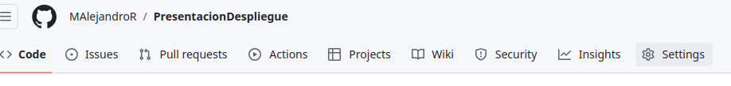
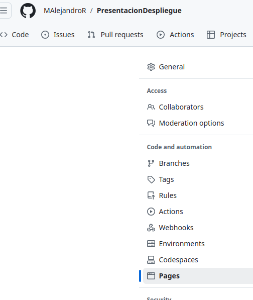
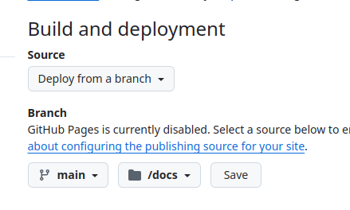

### 1. Crear el Repositorio en GitHub

Ve a [GitHub](https://github.com/), inicia sesión y crea un nuevo repositorio (esta sección ya la hemos realizado previamente:
* Haz clic en  New  en la esquina superior derecha.
* Nombra el repositorio, por ejemplo, **`mi-proyecto-hugo`**
* Selecciona  público  si deseas que el sitio sea accesible para todos.
* Copiamos las instrucciones y vamos a local
* Terminamos el proceso para subir nuestro proyecto,  pero antes de ello debemos preparar nuestro proyecto de hugo para deplegarlo  

###  Configurar Hugo para deplegarlo

Por defecto, Hugo genera los archivos estáticos en la carpeta  /public , pero para desplegarlo, git espera que el sitio web esté en una carpeta llamada  /docs  para  GitHub Pages , que es dónde se va a desplegar.

1.- Configurar  config.toml  *(o config.yaml, según el formato de configuración que estés usando)*. 

publishDir = "docs"


También podemos especificarlo cuando creemos el despliegue en local

hugo -d docs


Esto le indicará a Hugo que genere todos los archivos del sitio estático dentro de la carpeta  docs , que es *donde GitHub Pages buscará los archivos*.

 2.- Establemcer el BaseURL 
Ahora debemos especificar la url base para componer todos los elementos relativos a ellos (páginas, imágenes, css, ...)


baseURL='https://<tu-usuario>.github.io/mi-proyecto-hugo/'


3.- Ahora generamos el sitio estático en la carpeta desplegando en la carpeta  docs 


hugo -d docs


4.- Subimos nuestro proyecto a git

### Configurando git para el despliegue
Ahora toca Configurar  GitHub Pages 

Ve a tu repositorio en GitHub y abre la pestaña  Settings (Configuración). 

En el menú de la izquierda, selecciona  Pages .

En la sección "Source", selecciona main como la rama, y /docs como la carpeta:

Guardas los cambios, y después de unos minutos, tu sitio debería estar desplegado en 
https://<tu-usuario>.github.io/mi-proyecto-hugo/  (o en la URL correspondiente a tu repositorio).

Puedes ver el proceso presionando la opción  actions  que es dónde se está ejectuando el código necesario para proceder al despliegue.

7. Probar y actualizar el sitio
   Puedes verificar si tu sitio se despliega correctamente visitando la URL proporcionada por GitHub Pages.

Cada vez que realices cambios en tu sitio, simplemente sigue estos pasos:

* Modifica tu contenido en Hugo.
* Genera nuevamente los archivos estáticos ejecutando hugo (que se guardarán en /docs).
* Realiza un commit de los cambios y súbelos a GitHub:


git add *
git commit -m "Actualizando el sitio"
git push origin main




**GitHub Pages detectará los cambios en la carpeta /docs y actualizará automáticamente tu sitio.**

