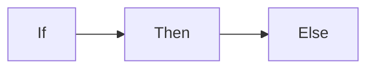

{}
Extensiones a markdown. 

**IMPORTANTE:** Se usan dentro del texto **.md** no en las plantillas

Doc: https://gohugo.io/content-management/shortcodes
{}

El párrafo que has escrito está bien enfocado para un nivel de ciclo superior de desarrollo web, pero tiene algunos pequeños detalles de estilo que se podrían ajustar para mejorar la fluidez del texto. Aquí te doy una versión ligeramente corregida, con algunas mejoras gramaticales y de redacción:

Un [shortcode](https://gohugo.io/content-management/shortcodes/) es un fragmento de código HTML que será renderizado a partir de un texto en un fichero .md cuando el sistema cargue o renderice la página de contenido.

Es una forma de añadir efectos visuales y funcionalidades adicionales a nuestro sitio web.

Vamos a ver algunos ejemplos. Cabe destacar que ciertos shortcodes son propios de una plantilla específica, pero no sería complicado reutilizarlos en otra.

Los shortcodes propios de cada tema están ubicados en la carpeta del tema  themes/nombre_tema/layouts/shortcodes , por lo que, si queremos crear los nuestros propios o modificar alguno existente, deberemos hacerlo en la carpeta raíz del proyecto, en  /layouts/shortcodes .

{}

### Shortcodes de hugo


**Cargar una página de redes sociales a partir de la referencia**

* Supongamos que me gusta un vidoeclip de música publicado en **youtube**, y la web es https://www.youtube.com/watch?v=j9WyKTGAO2w

 Pues podría cargar ese vídeo usando el **shortcode** de hugo


```go-html-template
{{ <youtube j9WyKTGAO2w>}}
```
El efecto de ponerlo es el siguiente


---
**Instagram**

```go-html-template
{{ < instagram BWNjjyYFxVx > }}
```
{{ <instagram BWNjjyYFxVx> }}

**Twitter**
```

```

Resultado


**Vimeo**
```go-html-template

```
Resultado


{}  

Veamos  alguno  ellos, propios de [Relearn](https://mcshelby.github.io/hugo-theme-relearn/shortcodes/index.html)

*  Badge 

Es una insignia de marca para mostrar un texto

```bash
{{`% badge %}}Important{{`% /badge %}}
{{`% badge style="primary" title="Version" %}}6.6.6{{`% /badge %}}
{{`% badge style="red" icon="angle-double-up" %}}Captain{{`% /badge %}}
{{`% badge style="info" %}}New{{`% /badge %}}
{{`% badge color="fuchsia" icon="fa-fw fab fa-hackerrank" %}}Awesome{{`% /badge %}}
```


Se verá:



Puedes cambiar color, icon style para personalizar


{}
#### Ver el resto de [shortcode](https://mcshelby.github.io/hugo-theme-relearn/shortcodes/index.html) que tiene la plantilla  Relearn.

* Badge
* Button
* Children
* Expand
* Highlight
* Icon
* Include
* Math
* Mermaid
* Notice
* OpenAPI (Este no lo vamos a usar ahora)
* Resources
* SiteParam
* Tab
* Tabs
****

{}

. Visita la página y pruébalos cada uno.

*Para practicar debes de probar con los siguientes shortcodes
#### button
*El uso es con la siguiente sintaxis
```shell
{}Label del botón{}
```
*Podemos incluir  atributos según puedes ver en la web de referencia 

#### resources
*Este shortcode es muy práctico e interesante. Con él podemos conseguir que aparezcan los recursos que contiene la carpeta actual (ficheros de imágenes, y documentos, exluyendo los md y html que tuviera la carpeta o [page bundle](https://gohugo.io/content-management/page-bundles/).


Una vez colocada en la carpeta los ficheros de recursos que queremos que sean accesibles por descarga, colocaremos en nuestro fichero *****md***** el shortcode
*El uso es con la siguiente sintaxis

`````go
{}
`````
Este shortcode tiene muchas opciones que puedes probar

#### mermaind
Interesante shortcode que 

El shortcode de Mermaid permite generar diagramas y diagramas de flujo a partir de texto, de manera similar a cómo se utiliza Markdown, gracias a la librería .

Aunque los ejemplos utilizan shortcodes con parámetros nombrados, se recomienda emplear bloques de código de Markdown en su lugar.

Esto se debe a que cada vez más herramientas soportan los bloques de código de Mermaid en Markdown (por ejemplo, GitHub), lo que hace que tu contenido sea más portátil.


visualizará:

Los gráficos generados pueden moverse arrastrándolos y hacer zoom con la rueda del ratón. En dispositivos móviles, se puede interactuar con gestos táctiles.


### Creación de un Shortcode en Hugo

En Hugo, los **shortcodes** son fragmentos reutilizables de código que permiten añadir contenido dinámico en tus páginas. Para crear un shortcode, sigue estos pasos:

1. Crea un archivo con la extensión `.html` en la carpeta `layouts/shortcodes/`.
2. Dentro del archivo, define el contenido del shortcode usando HTML o Go Templates.

Ejemplo de un shortcode básico (`example.html`):
```html
<p>Este es un contenido de shortcode: {{ .Get "text" }}</p>

```
Para usarlo en un archivo .md, llama al shortcode con:



   { {< example text="¡Hola, Shortcode!" >}}



Los shortcodes son útiles para insertar bloques de código repetitivos y personalizables en varias partes del sitio.



```css
/* Aquí podrías agregar estilos CSS personalizados para mejorar la presentación del shortcode */
```

#### Crear  Shortcodes personalizado

 Crear un Shortcode para Texto con Color Personalizado  
 


Este shortcode permite cambiar el color del texto que envuelvas en él, y si no especificas un color, usará el color rojo por defecto. A continuación te explico cómo crearlo:




1. Crear el shortcode:
> Creo en un directorio concreto un fichero llamado <strong> nombre_shortcode.html </strong> creando un <strong>trocito de html</strong>

2. Invocar al shortcode:
> En un fichero markdown, donde quiero   que se rederice ese trocito de html, lo invoco como vemos a continuación





contenido que se recibirá como .Inner dentro del shortcode



{}

Creando el shortcode:

1. Crea un archivo en la carpeta `layouts/shortcodes/` llamado `color.html`.     
2. Dentro del archivo `color.html`, añade este código:

3.- Un shortcode se crea y luego se invoca (2 conceptos que hay que tener muy claros)


```html
{{$color := .Get "color" | default "red" }}
<span style="color:{{ $color }}; font-weight:bold">
  { { .Inner }}
</span>
```


 Crear un Shortcode para Mostrar objetivos  



Este shortcode permite visualizar un listado de objetivos
Sería como éste cuadradito que estás viendo.
Y muestra su contenido como un listado de items.



> * En este caso queremos dos parámetros: el title y el subtitle
> * Por otro lado necesitamos coger el contenido y mostrarlo en una lista
> * Lo invocaremos así, el ejemplo anterior está invocado:


    Este shortcode permite visualizar un listado de objetivos
    Sería como éste cuadradito que estás viendo.
    Y muestra su contenido como un listado de items.



Luego, aplica ese color al texto que coloques dentro del shortcode.





 El código 


{ $title := .Get "title" | default "Objetivos" }}
{{ $sub_title := .Get "sub_title" | default "Qué veremos aquí" }}

<div style="border: 1px solid darkgreen; border-radius: 5px; overflow: hidden;">
    <div style="background-color:darkgreen; color:white;
    font-weight:bold; padding:10px; display: flex; align-items: center;">
        <!-- Icono de objetivos -->
        <span style="margin-right: 8px;">
            <i class="fas  fa-check-circle"></i> <!-- Icono de diana para "Objetivos" -->
        </span>
        <!-- Título en negrita con un poco de margen -->
        <span >{{ $title }}</span>
    </div>

    <h3 style="padding: 5px;font-weight:bold"> {{$sub_title}}</h3>

    <hr style="border-color:seagreen;border-width:3px"/>
    <!-- Texto con fondo más claro y margen interno -->
    <div style="background-color:#d0f0d0; color:darkgreen; padding: 10px;">
        <ul>
        {{ range (split .Inner "\n")}}
            {{- if gt (len .) 0 -}}
              <li>{{.}}</li>
            {{end}}
        {{ end}}
        </ul>

    </div>
</div>


 Puntos importantes para explicar 

1. Observa cómo creamos las variables y las leemos del shortcode dándelo un valor por defecto

   { $title := .Get "title" | default "Objetivos" }}
   {{ $sub_title := .Get "sub_title" | default "Qué veremos aquí" }}
 
2. A continuación va código html normal con estilo, pero observa cuando quiero escribir el valor de las variables previamente creados:

   

<div style="border: 1px solid darkgreen; border-radius: 5px; overflow: hidden;">
    <div style="background-color:darkgreen; color:white;
    font-weight:bold; padding:10px; display: flex; align-items: center;">
        <!-- Icono de objetivos -->
        <span style="margin-right: 8px;">
            <i class="fas  fa-check-circle"></i> <!-- Icono de diana para "Objetivos" -->
        </span>
        <!-- Título en negrita con un poco de margen -->
        <span >{{ $title }}</span>
    </div>

    <h3 style="padding: 5px;font-weight:bold"> {{$sub_title}}</h3>

    <hr style="border-color:seagreen;border-width:3px"/>
    <!-- Texto con fondo más claro y margen interno -->
   

    </div>
</div>


3. Como recojo el valor del contenido (inner), lo rompemos en filas y lo mostramos como un listado no ordenado
   4. Fíjate la manero de realizar un split o rotura de una cadena, quedándonos con un array de filas. Rompo la cadena con el carácter  fín de línea  . Para ello uso la función  split . 
   5. Para comprender mejor este código lo vamos a reescribir buscando una mayor legibilidad.

<div style="background-color:#d0f0d0; color:darkgreen; padding: 10px;">
        <ul>
            {{ $lineas := split .Inner "\n"}}
            {{ range $lineas}}
                {{ $linea := .}}
                {{ if gt (len $linea) 0 }}
                  <li>{{$linea}}</li>
                {{end}}
            {{ end}}
        </ul>

    </div>


1.  `$lineas` es un array con cada una de las líneas

    {{ $lineas := split .Inner "\n"}}
 
2.  `range` es la estructura de control que va a recorrer cada elemento del array

    {{ range $lineas}}
      ....      
    {{ end}}

3. En cada interación su valor que queda en el contexto actual refereniado con el `punto (.)`
4. Guardo el valor en la variabble `$linea` (busco legibilidad)

   {{ $linea := .}}
 
5. Verifico que la línea no esté vacía, para eliminar líneas en blanco 

   {{ if gt (len $linea) 0 }}
   ..... 
   {{end}}
 
6. Visualizo su contenido en un elemento de hmtl <li>
  
   <li>{{$linea}}</li>
  

{}
Observa cómo cualquier estructura que abramos, hay que cerrarla
```got-html-template
{{range ...}}
 // código de este blucle
{{end}}
{{if ...}}
 // código de esta selección 
{{end}}
```
Si no lo haces, te dará un error EOF (Encuento el final de fichero y no debería de haberlo encontrado, ya que tendría que haber encontrado antes un final de estructrua de control).
{}


### Práctica

Accede a la información de de [shortcode de la plantilla de relearn](https://mcshelby.github.io/hugo-theme-relearn/shortcodes/)

Incluye en tu trabajo los elementos que a continuación se muestran

1 Botones

2 Páginas de descargas

3 Acortar un texto con leer mas...

4 Texto remarcado como una noticia

5 Crear gráficos con mermaid (opcional)

6 tabs de diferentes elementos

### :question:
{}
Si tienes alguna duda, pregunta o envía un mensaje para aclarar.
{} 

