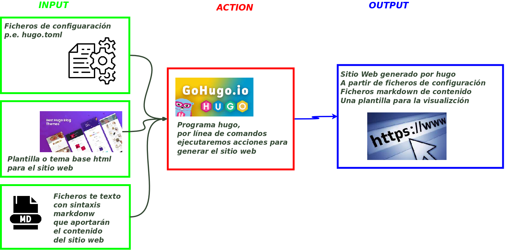

Todo esto, está hecho con el :heart: :smile:  

{}
* Introducción a la generación de sitios web con HUGO
* Crear un sitio estático con hugo
* Instala, configura y agrega contenidos usando una plantilla.
{}
 
 

#### ¿Por qué un generador de sitios estáticos?
* Rapidez
* Seguridad
* Eficiencia
* Consistencia de contenidos y formatos
---

# Listado de la teoría:
{}
 **Listado de páginas de referencia**
 ***
 [Manuales sencillos y muy completos](https://cloudcannon.com/community/learn/hugo-beginner-tutorial/)  
>   *****https://cloudcannon.com/community/learn/hugo-beginner-tutorial/*****
{}
>


<h3>Desarrollo de sitios web usando el framework hugo</h3>

En este tema, se comprenderán las bases del **desarrollo web estático** utilizando **Hugo**, un framework rápido y flexible para la creación de sitios web.

A través de ejercicios prácticos, se explorarán diferentes aspectos de Hugo, desde la instalación hasta la personalización y despliegue de sitios.


## Objetivos

1. **Comprender el flujo de trabajo de Hugo**:
 - Los alumnos aprenderán a configurar un entorno de desarrollo para trabajar con Hugo, explorando su estructura de directorios y el proceso de generación de sitios estáticos.

2. **Instalar y configurar Hugo**:
 - Instalar Hugo en diferentes sistemas operativos.
 - Configurar y crear un nuevo sitio utilizando plantillas y temas disponibles.

3. **Crear y gestionar contenido dinámico y estático**:
 - Crear contenido utilizando archivos **Markdown** y aprender a gestionar distintos tipos de contenidos como blogs, portfolios y documentación.
 - Gestionar y organizar recursos estáticos como imágenes, hojas de estilo y scripts.

4. **Personalizar la apariencia del sitio**:
 - Personalizar plantillas existentes y crear nuevas estructuras de diseño utilizando el sistema de **layouts** de Hugo.
 - Integrar hojas de estilo (**CSS**) y ejecutar scripts de cliente (**JavaScript**).

5. **Comprender y aplicar el uso de shortcodes**:
 - Utilizar y personalizar **shortcodes** para añadir elementos complejos al sitio, como botones, vídeos, y bloques de código.

6. **Optimizar y desplegar el sitio**:
 - Aprender a optimizar el sitio para mejorar el rendimiento y el SEO.
 - Desplegar el sitio utilizando plataformas como **Netlify** o **GitHub Pages**.

7. **Integración de Hugo con Git**:
 - Utilizar **Git** para el control de versiones y gestionar colaboraciones en proyectos de sitios web creados con Hugo.
 - Aprender a utilizar submódulos de Git para gestionar temas de Hugo.

## :smile: Al final del tema

- Tendremos la capacidad para crear sitios web estáticos utilizando Hugo de manera eficiente.
- Podremos  personalizar y gestionar contenido dinámico en un entorno estático.
- Capacidad para integrar herramientas y servicios externos, optimizar y desplegar sitios en diferentes plataformas.

---

**Duración del tema**: 10 horas

**Prerrequisitos**: Conocimientos básicos de HTML, CSS, y Git.

Tener muchas ganas de disfrutar y crear tu página web


