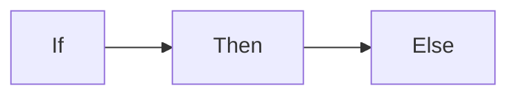

{}
Extensiones a markdown. 

**IMPORTANTE:** Se usan dentro del texto **.md** no en las plantillas

Doc: https://gohugo.io/content-management/shortcodes
{}

El párrafo que has escrito está bien enfocado para un nivel de ciclo superior de desarrollo web, pero tiene algunos pequeños detalles de estilo que se podrían ajustar para mejorar la fluidez del texto. Aquí te doy una versión ligeramente corregida, con algunas mejoras gramaticales y de redacción:

Un [shortcode](https://gohugo.io/content-management/shortcodes/) es un fragmento de código HTML que será renderizado a partir de un texto en un fichero .md cuando el sistema cargue o renderice la página de contenido.

Es una forma de añadir efectos visuales y funcionalidades adicionales a nuestro sitio web.

Vamos a ver algunos ejemplos. Cabe destacar que ciertos shortcodes son propios de una plantilla específica, pero no sería complicado reutilizarlos en otra.

Los shortcodes propios de cada tema están ubicados en la carpeta del tema  themes/nombre_tema/layouts/shortcodes , por lo que, si queremos crear los nuestros propios o modificar alguno existente, deberemos hacerlo en la carpeta raíz del proyecto, en  /layouts/shortcodes .

{}

### Shortcodes de hugo


**Cargar una página de redes sociales a partir de la referencia**

* Supongamos que me gusta un vidoeclip de música publicado en **youtube**, y la web es https://www.youtube.com/watch?v=j9WyKTGAO2w

 Pues podría cargar ese vídeo usando el **shortcode** de hugo


```go-html-template
{{ <youtube j9WyKTGAO2w>}}
```
El efecto de ponerlo es el siguiente


---
**Instagram**

```go-html-template
{{ < instagram BWNjjyYFxVx > }}
```
{{ <instagram BWNjjyYFxVx> }}

**Twitter**
```

```

Resultado


**Vimeo**
```go-html-template

```
Resultado


{}  

Veamos  alguno  ellos, propios de [Relearn](https://mcshelby.github.io/hugo-theme-relearn/shortcodes/index.html)

*  Badge 

Es una insignia de marca para mostrar un texto

```bash
{{`% badge %}}Important{{`% /badge %}}
{{`% badge style="primary" title="Version" %}}6.6.6{{`% /badge %}}
{{`% badge style="red" icon="angle-double-up" %}}Captain{{`% /badge %}}
{{`% badge style="info" %}}New{{`% /badge %}}
{{`% badge color="fuchsia" icon="fa-fw fab fa-hackerrank" %}}Awesome{{`% /badge %}}
```


Se verá:



Puedes cambiar color, icon style para personalizar


{}
#### Ver el resto de [shortcode](https://mcshelby.github.io/hugo-theme-relearn/shortcodes/index.html) que tiene la plantilla  Relearn.

* Badge
* Button
* Children
* Expand
* Highlight
* Icon
* Include
* Math
* Mermaid
* Notice
* OpenAPI (Este no lo vamos a usar ahora)
* Resources
* SiteParam
* Tab
* Tabs
****

{}

. Visita la página y pruébalos cada uno.

*Para practicar debes de probar con los siguientes shortcodes
#### button
*El uso es con la siguiente sintaxis
```shell
{}Label del botón{}
```
*Podemos incluir  atributos según puedes ver en la web de referencia 

#### resources
*Este shortcode es muy práctico e interesante. Con él podemos conseguir que aparezcan los recursos que contiene la carpeta actual (ficheros de imágenes, y documentos, exluyendo los md y html que tuviera la carpeta o [page bundle](https://gohugo.io/content-management/page-bundles/).


Una vez colocada en la carpeta los ficheros de recursos que queremos que sean accesibles por descarga, colocaremos en nuestro fichero *****md***** el shortcode
*El uso es con la siguiente sintaxis

`````go
{}
`````
Este shortcode tiene muchas opciones que puedes probar


#### extends


#### notice

#### mermaind
Interesante shortcode que 

El shortcode de Mermaid permite generar diagramas y diagramas de flujo a partir de texto, de manera similar a cómo se utiliza Markdown, gracias a la librería .

Aunque los ejemplos utilizan shortcodes con parámetros nombrados, se recomienda emplear bloques de código de Markdown en su lugar.

Esto se debe a que cada vez más herramientas soportan los bloques de código de Mermaid en Markdown (por ejemplo, GitHub), lo que hace que tu contenido sea más portátil.


visualizará:

Los gráficos generados pueden moverse arrastrándolos y hacer zoom con la rueda del ratón. En dispositivos móviles, se puede interactuar con gestos táctiles.


### Práctica

Accede a la información de de [shortcode de la plantilla de relearn](https://mcshelby.github.io/hugo-theme-relearn/shortcodes/)

Incluye en tu trabajo los elementos que a continuación se muestran

1 Botones

2 Páginas de descargas

3 Acortar un texto con leer mas...

4 Texto remarcado como una noticia

5 Crear gráficos con mermaid (opcional)

6 tabs de diferentes elementos

### :question:
{}
Si tienes alguna duda, pregunta o envía un mensaje para aclarar.
{} 

